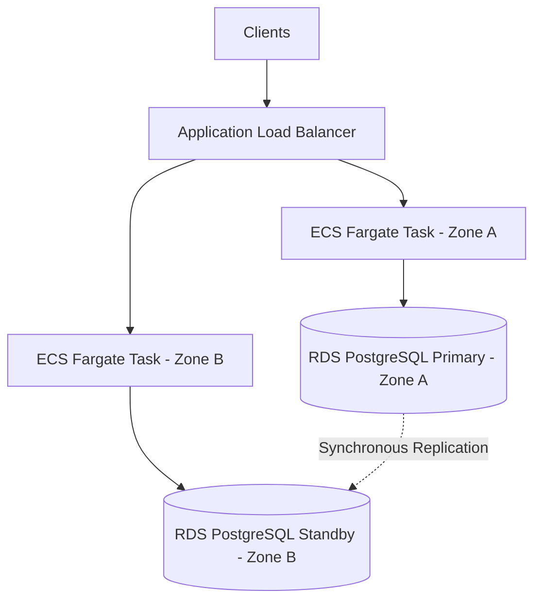

# Disaster Recovery & High-Availability Playbook — LitSecure Sentinel

**Classification:** Restricted / Proprietary
**Target Audience:** Site Reliability Engineers (SRE), Database Administrators, Infrastructure Lead

---

## 1. Objectives, RTO & RPO
This playbook defines the strategies and workflows to ensure high-availability and disaster recovery for the **LitSecure Sentinel** incident response platform.

* **Recovery Time Objective (RTO):** < 15 minutes (time allowed to restore services in case of full region outage).
* **Recovery Point Objective (RPO):** < 5 minutes (maximum allowed data loss duration).

---

## 2. Infrastructure Architecture
To achieve high availability, LitSecure Sentinel runs in a Multi-AZ (Availability Zone) active-active deployment:



- **Application Tier:** 3 replicas minimum running on AWS ECS Fargate, distributed across three AZs (us-east-1a, 1b, 1c).
- **Database Tier:** AWS RDS PostgreSQL Multi-AZ instance. Synchronous replication commits data in both zones before completing requests.

---

## 3. High-Availability Failover Scenarios

### Scenario A: Individual Availability Zone Outage
1. **Detection:** AWS ALB health check monitors the ECS Tasks via `/api/health/live`. If an AZ fails, the ALB marks those tasks unhealthy.
2. **Auto-Recovery:** ECS service automatically terminates the failing containers and starts replacement containers in the remaining healthy zones.
3. **Database:** If the primary DB zone goes dark, RDS automatically triggers failover to the standby zone within 60 seconds. Client connections transition automatically without changing hostnames (managed by AWS DNS).

### Scenario B: Database Connection Lock / Timeout
1. **Symptom:** App servers report "PostgreSQL pool limit reached" or WAL locks.
2. **Mitigation:**
   - Temporarily scale down ECS replicas to release locks, then scale back up.
   - Sentinel has a **local offline fallback (SQLite database)**. If the PostgreSQL/Supabase pool is unreachable, the system caches incident records locally in `data/sentinel.db`. Once the PostgreSQL pool recovers, SREs trigger event synchronization.

---

## 4. Disaster Recovery Walkthrough (Full Region Outage)
If `us-east-1` goes completely offline, we must failover to the secondary standby region `us-west-2`.

### Step 1: Initialize Secondary VPC & Resources
Verify that the secondary region resources are created via Terraform. Keep a replication database configuration ready:
```bash
# Initialize Terraform in secondary region
cd infra/terraform
terraform init
terraform workspace select backup-region || terraform workspace new backup-region
terraform apply -var="aws_region=us-west-2" -var-file="prod.tfvars"
```

### Step 2: Database Restoration
Restore the database from the latest cross-region RDS snapshot (scheduled daily to S3):
1. Navigate to RDS Console -> Snapshots -> Select the latest snapshot for `litsecure-prod-db`.
2. Click **Restore DB Instance** -> Choose target VPC and subnet groups in `us-west-2`.
3. Set the restored database identifier to `litsecure-prod-db-restored`.
4. Update the ConfigMap `DATABASE_URL` parameter in Kubernetes or ECS env variables to target the new database endpoint.

### Step 3: Route 53 Traffic Switch
Switch client traffic to the secondary ALB endpoint:
1. Open AWS Route 53 Console.
2. Select DNS Zone `sentinel.litsecure.gov`.
3. Edit the alias record pointing to ALB and input the DNS name of the secondary ALB provisioned in `us-west-2`.
4. Reduce TTL to 60 seconds to ensure swift DNS propagation.

### Step 4: Health Verification
Execute curl commands to verify the restored environment:
```bash
curl -f https://sentinel.litsecure.gov/api/health/live
```
Confirm WebSocket connections and incident analytics widgets resolve successfully.
