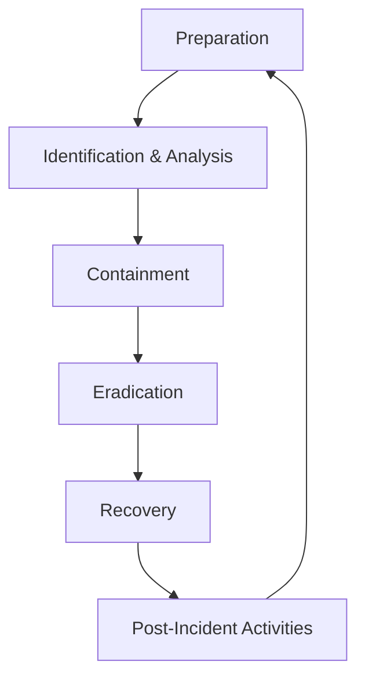

# Incident Response Playbook — National Cyber Intelligence Platform (LitSecure Sentinel)

**Classification:** Confidencial / Restricted
**Target Audience:** Security Operations Center (SOC) Analysts, Incident Commanders, National CERT Officers

---

## 1. Objectives & Scope
This document outlines the standard operational playbook for identifying, containing, eradicating, and recovering from cybersecurity incidents logged or analyzed within the **LitSecure Sentinel** ecosystem. 

It covers:
- System intrusions and unauthorized access.
- Malware outbreaks (using Sentinel's static binary scan results).
- Critical vulnerability alerts (e.g. CVSS >= 9.0).
- Network level anomalies and brute-force campaigns.

---

## 2. Incident Response Lifecycle

### Phase 1: Preparation
1. **Tool Access Verification:**
   - Analysts must maintain active multi-factor authentication (MFA).
   - Ensure the Sentinel server metrics `/metrics` are streaming to Prometheus/Grafana.
   - Verify connection pool status to PostgreSQL/Supabase.
2. **Contact Matrices:**
   - Incident Commander: `incident-commander@litsecure.gov`
   - National CERT: `cert@government-cybersec.gov`
   - CISO/CPO Alerting Group: `/api/notifications/telegram`

### Phase 2: Identification & Analysis
1. **Alert Triage:**
   - Review active incident feeds inside LitSecure Sentinel's dashboard.
   - For malicious file detections, download hash from Sentinel UI and cross-reference with VirusTotal/MalwareBazaar or local YARA rules output.
   - Check CVSS v3.1 vector calculations for CVE alerts:
     - **AV:N / AC:L / PR:N / UI:N** -> High Priority (immediate internet threat).
2. **Categorization:**
   - **Severity 1 (Critical):** Active ransomware, data exfiltration, system takeover, or compromised super-admin accounts.
   - **Severity 2 (High):** Malware detected on internal subnets, database unauthorized queries, or active brute-force blocks.
   - **Severity 3 (Medium):** Vulnerability identified on non-public facing servers, or misconfigured security headers.
   - **Severity 4 (Low):** General reconnaissance ports scanned, minor network logs flags.

### Phase 3: Containment
1. **Short-Term Containment Actions:**
   - **Account Disablement:** Revoke the user sessions immediately. Since LitSecure uses RTR (Refresh Token Rotation), rotate user keys or purge active token contexts from the `refresh_tokens` table.
   - **Network Isolation:** Instruct local network admins to isolate affected containers (use Kubernetes NetworkPolicies to drop traffic to `sentinel-deployment` pods showing anomalous outbound behavior).
2. **Long-Term Containment:**
   - Apply micro-segmentation.
   - Spin up new sanitized replicas on AWS ECS Fargate and redirect traffic via ALB routing.

### Phase 4: Eradication
1. **Malware Removal:**
   - Quarantine and delete malicious binary paths identified by the static analyzer.
   - Audit system startup files and systemd service scripts for persistence vectors.
2. **Vulnerability Remediation (Patching):**
   - For open CVE advisories, locate the affected assets using the **Vulnerability DB** tab.
   - Test the vendor-supplied patch in a staging environment.
   - Upgrade libraries and compile the service. Update the status in Sentinel from `Open` to `Remediated` with detailed verification notes.

### Phase 5: Recovery
1. **Restoration:**
   - Rebuild affected virtual hosts or container filesystems using approved base Docker images.
   - Restore database snapshots from AWS RDS (if data integrity checks pass).
2. **Monitoring & Verification:**
   - Keep the affected asset under active monitoring for 14 days.
   - Verify `/metrics` counts for HTTP errors or anomalous traffic volume.

### Phase 6: Post-Incident Activities
1. **Post-Mortem Meeting:**
   - Convene within 72 hours of incident closure.
   - Analyze the root cause (e.g. out-of-date package, missing TLS header, leaked credentials).
2. **Lessons Learned:**
   - Document any gaps in current signatures (YARA or static indicators).
   - Update the Sentinel detection rules or audit logging metrics parameters.
